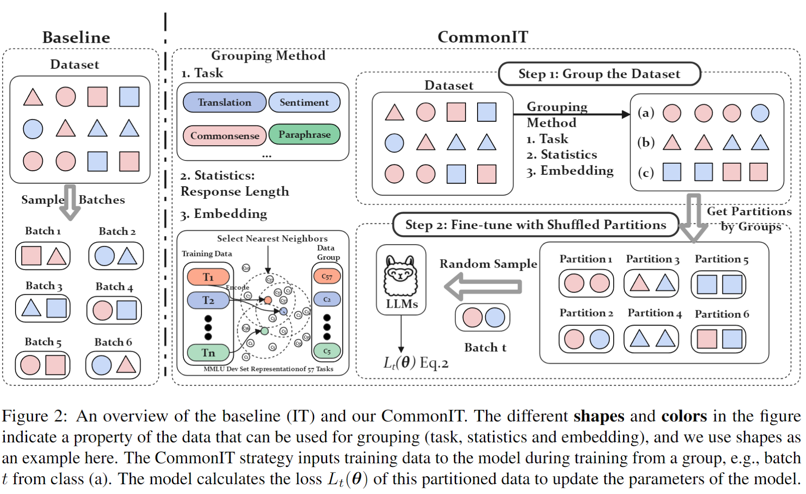

# CommonIT
Code for the EMNLP 2024 (long talk) paper: "CommonIT: Commonality-Aware Instruction Tuning for Large Language Models via Data Partitions"


### **Overview**

We propose CommonIT to enhance the instruction-following capabilities of LLMs.

<div align="center">
    </img>
    <p class="image-caption">CommonIT</p>
</div>


### **Installation**

```bash
git clone https://github.com/raojay7/CommonIT.git
cd CommonIT
pip install -r requirments.txt
```

### **Fine-tuning**

(1) **Dataset Preparation**: 

Our approach requires a user-defined data set to be structured into multiple datasets, which typically works best if divided precisely by task type.

(2) **Training New Models**

- [train/train_7B.sh](https://github.com/raojay7/CommonIT/tree/main/scripts/train_7B.sh)
  
The core code can be found in MultiSubsetBatchSampler and DistributedSubsetRandomSampler in train.py.


### **Evaluation**

Using open-instruct for evaluating:
[URL: https://github.com/allenai/open-instruct/tree/main](https://github.com/allenai/open-instruct/tree/main)

- MMLU

```
# Evaluating llama 7B model using 5 shot directly
python -m eval.mmlu.run_eval \
    --ntrain 5 \
    --data_dir data/eval/mmlu \
    --save_dir results/mmlu/llama-7B-5shot \
    --model_name_or_path ../hf_llama_models/7B \
    --tokenizer_name_or_path ../hf_llama_models/7B \
    --eval_batch_size 4 \
```
- BBH
```
  # Evaluating llama 7B model using chain-of-thought
python -m eval.bbh.run_eval \
    --data_dir data/eval/bbh \
    --save_dir results/bbh/llama-7B-cot/ \
    --model ../hf_llama_models/7B \
    --tokenizer ../hf_llama_models/7B \
    --max_num_examples_per_task 40 \
```
- GSM
```
# Evaluating llama 7B model using chain-of-thought
python -m eval.gsm.run_eval \
    --data_dir data/eval/gsm/ \
    --max_num_examples 200 \
    --save_dir results/gsm/llama-7B-cot-8shot \
    --model ../hf_llama_models/7B \
    --tokenizer ../hf_llama_models/7B \
    --n_shot 8 \
```
- CODE
```
# Evaluating llama 7B model using temperature 0.8 to get the pass@10 score
python -m eval.codex_humaneval.run_eval \
    --data_file data/eval/codex_humaneval/HumanEval.jsonl.gz \
    --eval_pass_at_ks 10 \
    --unbiased_sampling_size_n 20 \
    --temperature 0.8 \
    --save_dir results/codex_humaneval/llama_7B_temp_0_8 \
    --model ../hf_llama_models/7B/ \
    --tokenizer ../hf_llama_models/7B/ \
```

## **📝 Citation**<a name="citation"></a>
If you find this repo useful, please cite our paper as:
```
@inproceedings{commonIT,
    title = "CommonIT: Commonality-Aware Instruction Tuning for Large Language Models via Data Partitions",
    author = "Rao, Jun  and
      Xuebo, Liu  and
      Lian, Lian  and
      Cheng, Shengjun  and
      Liao, Yunjie  and
      Zhang, Min",
    booktitle = "EMNLP",
    year = "2024",
}
```
## Acknowledgements
The code is based on [LLMZoo](https://github.com/FreedomIntelligence/LLMZoo) and [ZeroVL](https://github.com/zerovl/ZeroVL).


